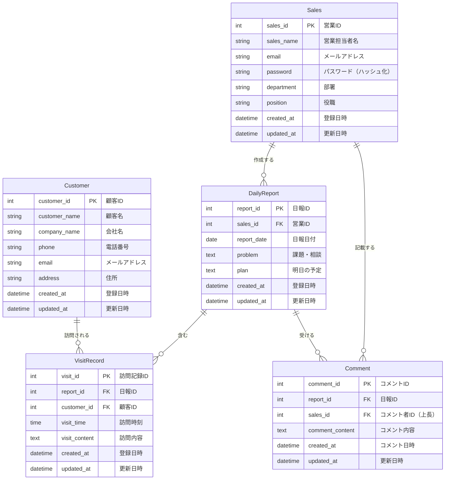

# 営業日報システム ER図

## エンティティ関連図（ERD）



## エンティティ説明

### Sales（営業担当者）

営業担当者の基本情報を管理するマスタテーブル

**リレーション:**

- DailyReportへ: 1対多（1人の営業が複数の日報を作成）
- Commentへ: 1対多（1人の上長が複数のコメントを記載）

---

### Customer（顧客）

営業先顧客の基本情報を管理するマスタテーブル

**リレーション:**

- VisitRecordへ: 1対多（1顧客に対して複数回訪問可能）

---

### DailyReport（日報）

営業担当者が日次で作成する日報

**リレーション:**

- Salesから: 多対1（多くの日報が1人の営業に属する）
- VisitRecordへ: 1対多（1つの日報に複数の訪問記録）
- Commentへ: 1対多（1つの日報に複数のコメント）

**制約:**

- sales_id + report_dateでユニーク制約（1営業担当者につき1日1件）

---

### VisitRecord（訪問記録）

日報に含まれる個別の訪問履歴

**リレーション:**

- DailyReportから: 多対1（多くの訪問記録が1つの日報に属する）
- Customerから: 多対1（多くの訪問記録が1顧客に属する）

---

### Comment（コメント）

上長が日報に対して記載するフィードバック

**リレーション:**

- DailyReportから: 多対1（多くのコメントが1つの日報に属する）
- Salesから: 多対1（多くのコメントが1人の上長に属する）

---

## カーディナリティ詳細

| リレーション              | カーディナリティ | 説明                                    |
| ------------------------- | ---------------- | --------------------------------------- |
| Sales - DailyReport       | 1:N              | 1人の営業担当者は複数の日報を作成できる |
| Sales - Comment           | 1:N              | 1人の上長は複数のコメントを記載できる   |
| Customer - VisitRecord    | 1:N              | 1顧客に対して複数回訪問できる           |
| DailyReport - VisitRecord | 1:N              | 1つの日報に複数の訪問記録を含む         |
| DailyReport - Comment     | 1:N              | 1つの日報に複数のコメントを受けられる   |

---

## インデックス推奨

パフォーマンス向上のため、以下のインデックスを推奨：

### DailyReport

```sql
CREATE INDEX idx_daily_report_sales_date ON DailyReport(sales_id, report_date);
CREATE INDEX idx_daily_report_date ON DailyReport(report_date);
```

### VisitRecord

```sql
CREATE INDEX idx_visit_record_report ON VisitRecord(report_id);
CREATE INDEX idx_visit_record_customer ON VisitRecord(customer_id);
```

### Comment

```sql
CREATE INDEX idx_comment_report ON Comment(report_id);
CREATE INDEX idx_comment_sales ON Comment(sales_id);
```

### Sales

```sql
CREATE UNIQUE INDEX idx_sales_email ON Sales(email);
```

---

## 外部キー制約

### VisitRecord

```sql
FOREIGN KEY (report_id) REFERENCES DailyReport(report_id) ON DELETE CASCADE
FOREIGN KEY (customer_id) REFERENCES Customer(customer_id) ON DELETE RESTRICT
```

### Comment

```sql
FOREIGN KEY (report_id) REFERENCES DailyReport(report_id) ON DELETE CASCADE
FOREIGN KEY (sales_id) REFERENCES Sales(sales_id) ON DELETE RESTRICT
```

### DailyReport

```sql
FOREIGN KEY (sales_id) REFERENCES Sales(sales_id) ON DELETE RESTRICT
```

**制約の説明:**

- **ON DELETE CASCADE**: 親レコード削除時に子レコードも削除
  - 日報削除時に訪問記録・コメントも削除
- **ON DELETE RESTRICT**: 親レコード削除を制限
  - 訪問記録がある顧客は削除不可
  - 日報・コメントがある営業担当者は削除不可

---

## データ型詳細（PostgreSQL例）

```sql
-- Sales
sales_id: SERIAL PRIMARY KEY
sales_name: VARCHAR(100) NOT NULL
email: VARCHAR(255) NOT NULL UNIQUE
password: VARCHAR(255) NOT NULL
department: VARCHAR(100) NOT NULL
position: VARCHAR(50) NOT NULL
created_at: TIMESTAMP DEFAULT CURRENT_TIMESTAMP
updated_at: TIMESTAMP DEFAULT CURRENT_TIMESTAMP

-- Customer
customer_id: SERIAL PRIMARY KEY
customer_name: VARCHAR(100) NOT NULL
company_name: VARCHAR(200) NOT NULL
phone: VARCHAR(20)
email: VARCHAR(255)
address: VARCHAR(500)
created_at: TIMESTAMP DEFAULT CURRENT_TIMESTAMP
updated_at: TIMESTAMP DEFAULT CURRENT_TIMESTAMP

-- DailyReport
report_id: SERIAL PRIMARY KEY
sales_id: INTEGER NOT NULL REFERENCES Sales(sales_id)
report_date: DATE NOT NULL
problem: TEXT
plan: TEXT
created_at: TIMESTAMP DEFAULT CURRENT_TIMESTAMP
updated_at: TIMESTAMP DEFAULT CURRENT_TIMESTAMP
UNIQUE(sales_id, report_date)

-- VisitRecord
visit_id: SERIAL PRIMARY KEY
report_id: INTEGER NOT NULL REFERENCES DailyReport(report_id) ON DELETE CASCADE
customer_id: INTEGER NOT NULL REFERENCES Customer(customer_id) ON DELETE RESTRICT
visit_time: TIME
visit_content: VARCHAR(1000) NOT NULL
created_at: TIMESTAMP DEFAULT CURRENT_TIMESTAMP
updated_at: TIMESTAMP DEFAULT CURRENT_TIMESTAMP

-- Comment
comment_id: SERIAL PRIMARY KEY
report_id: INTEGER NOT NULL REFERENCES DailyReport(report_id) ON DELETE CASCADE
sales_id: INTEGER NOT NULL REFERENCES Sales(sales_id) ON DELETE RESTRICT
comment_content: VARCHAR(1000) NOT NULL
created_at: TIMESTAMP DEFAULT CURRENT_TIMESTAMP
updated_at: TIMESTAMP DEFAULT CURRENT_TIMESTAMP
```

---

## 改訂履歴

| 版数 | 改訂日     | 改訂者 | 改訂内容 |
| ---- | ---------- | ------ | -------- |
| 1.0  | 2026/01/02 | -      | 初版作成 |
